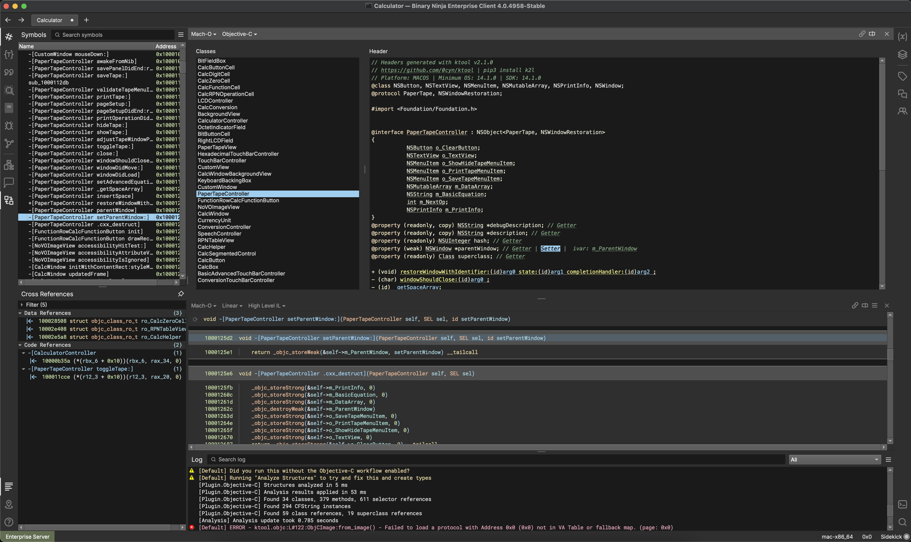

# bn_objc_ui

#### Required Pretty Screenshot:



## WIP

This plugin is currently a simple Triage View for Objective-C Binaries in BinaryNinja. 

It is a work in progress and is not yet feature complete. I'm putting it on github so I don't forget it exists <3

It exists as part of a project aimed at integrating `ktool`'s utilities into BinaryNinja.

`ktool` is a long-standing, long-maintained python-only project for Objective-C introspection and metadata dumping.

## Installation 

Presumably at some point this will be in the plugin manager. 

For now, as a user you can install it like so

mac:
```bash
cd ~/Library/Application\ Support/Binary\ Ninja/plugins
git clone https://github.com/0cyn/bn_objc_ui.git
``` 
linux:
```bash
cd ~/.binaryninja/plugins
git clone https://github.com/0cyn/bn_objc_ui.git
```
win: (you can also just download the zip and unzip it in the plugin dirif you dont have git.exe)
```bat
cd %APPDATA%\Binary Ninja\plugins
git clone https://github.com/0cyn/bn_objc_ui.git
```

## Dev

This has some bootstrapping utils that were written for Darwin and try to also work on unix. Upstream contribs to them
should go into https://github.com/0cyn/bn_python_plugin 

This describes how to set things up with Jetbrains. I have no idea with VSCode but it should be fairly similar, 
they both just need to wrap `install_unix.sh`

For basic auto-installation:  
Create a new Launch Configuration for a shell script, and target it to `install_unix.sh`.  
This script will try to determine the location and configuration of binja required to install the plugin and its dependencies.

Linux Requires the envar:
* `BINARYNINJA_PATH=/path/to/binaryninja`

For debugging w/ jetbrains:
1. Create a new Launch Configuration for a shell script, and target it to `install_unix.sh`. 
2. Create a new Launch Configuration for the python debugger and add the previous shell script as a "Run before building" step
3. Optionally create a path mapping in the debugger conf like so:
`/Users/cynder/src/bn_objc_ui/src=/Users/cynder/Library/Application Support/Binary Ninja/plugins/ObjC Helper/src`
4. Use it

If you are using jetbrains:
* pass `USE_JETBRAINS_DEBUGGER=1` envar to this script. 
* pass `JETBRAINS_DEBUG_PORT="12345"` where 12345 is the port you entered into the jetbrains debug config setup

You should probably pass `JETBRAINS_PYDEVD_VERSION="X.X.X"`, where X.X.X is the version of pydevd Jetbrains wants you to use (see debug config dialog)
It will default to my local version which may not work for you.

If you are using VSCode:
* pass `USE_VSCODE_DEBUGGER=1` envar to this script.
* pass `VSCODE_DEBUG_PORT="12345"` where 12345 is the port you entered into the vscode debug config setup


