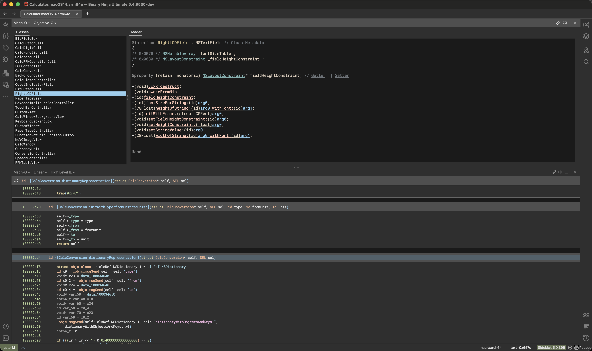

# bn_objc_ui

Development on this plugin has ceased, with the plugin being stable on at least Stable 5.3.9434

#### Required Pretty Screenshot:



## WIP

This is a python plugin that leverages BinaryNinja's built in Objective-C processing to 
generate headers you can click on to navigate to Objective-C functions and information. 

The goal is to make reverse engineering Objective-C Binaries much easier

## Installation

### Transient dependency

Currently, this project depends on pygments, as we pull their stylesheets in for rendering our HTML.

Whenever the final theme is decided on, unless it's decided that theme should be configurable, this theme will be 
vendored in and the dependency removed. 

### Manually installing

You can install this by searching "Objective-C Helper" in the extension manager. 

The instructions for installing it manually are below:

mac:
```bash
cd ~/Library/Application\ Support/Binary\ Ninja/plugins
git clone https://github.com/0cyn/bn_objc_ui.git
``` 
linux:
```bash
cd ~/.binaryninja/plugins
git clone https://github.com/0cyn/bn_objc_ui.git
```
win: (you can also just download the zip and unzip it in the plugin dir if you dont have git.exe)
```bat
cd %APPDATA%\Binary Ninja\plugins
git clone https://github.com/0cyn/bn_objc_ui.git
```

## Dev

This has some bootstrapping utils that were written for Darwin and try to also work on unix. Upstream contribs to them
should go into https://github.com/0cyn/bn_python_plugin 

This describes how to set things up with Jetbrains. I have no idea with VSCode but it should be fairly similar, 
they both just need to wrap `install_unix.sh`

For basic auto-installation:  
Create a new Launch Configuration for a shell script, and target it to `install_unix.sh`.  
This script will try to determine the location and configuration of binja required to install the plugin and its dependencies.

Linux Requires the envar:
* `BINARYNINJA_PATH=/path/to/binaryninja`

For debugging w/ jetbrains:
1. Create a new Launch Configuration for a shell script, and target it to `install_unix.sh`. 
2. Create a new Launch Configuration for the python debugger and add the previous shell script as a "Run before building" step
3. Optionally create a path mapping in the debugger conf like so:
`/Users/cynder/src/bn_objc_ui/src=/Users/cynder/Library/Application Support/Binary Ninja/plugins/ObjC Helper/src`
4. Use it

If you are using jetbrains:
* pass `USE_JETBRAINS_DEBUGGER=1` envar to this script. 
* pass `JETBRAINS_DEBUG_PORT="12345"` where 12345 is the port you entered into the jetbrains debug config setup

You should probably pass `JETBRAINS_PYDEVD_VERSION="X.X.X"`, where X.X.X is the version of pydevd Jetbrains wants you to use (see debug config dialog)
It will default to my local version which may not work for you.

If you are using VSCode:
* pass `USE_VSCODE_DEBUGGER=1` envar to this script.
* pass `VSCODE_DEBUG_PORT="12345"` where 12345 is the port you entered into the vscode debug config setup


